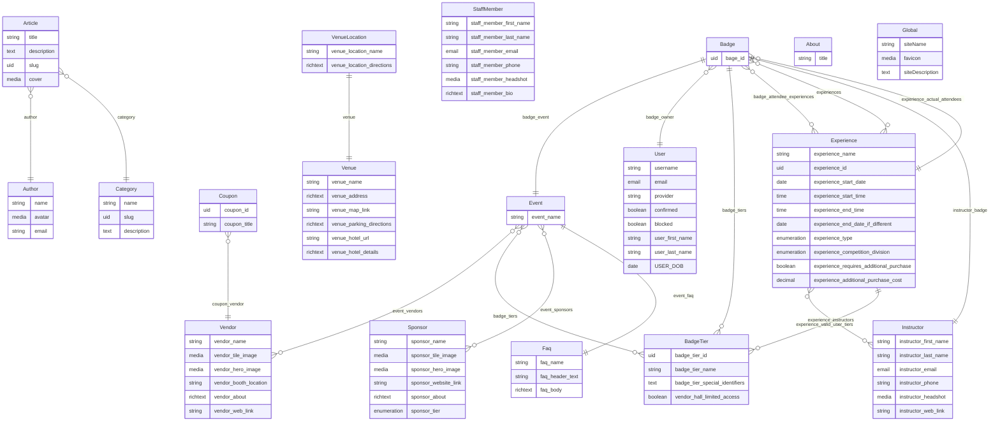

# Strapi Schema Reference

> Auto-generated from `RNGX/src/api` — **18 content type(s)**, **9 component(s)**

---

## Table of Contents

1. [Content Types Overview](#content-types-overview)
2. [Content Types](#content-types)
   - [Article](#article)
   - [Author](#author)
   - [badge](#badge)
   - [badge_tier](#badgetier)
   - [Category](#category)
   - [coupon](#coupon)
   - [event](#event)
   - [experience](#experience)
   - [faq](#faq)
   - [instructor](#instructor)
   - [sponsor](#sponsor)
   - [staff member](#staff-member)
   - [User](#user)
   - [vendor](#vendor)
   - [venue](#venue)
   - [venue_location](#venuelocation)
   - [About](#about)
   - [Global](#global)
3. [Shared Components](#shared-components)
4. [Entity Relationship Diagram](#entity-relationship-diagram)

---

## Content Types Overview

| Display Name | API ID | Collection Name | Kind | Draft & Publish | i18n | shouldBeIgnored? |
| --- | --- | --- | --- | --- | --- | --- |
| Article | `api::article.article` | `articles` | collectionType | Yes | No | Yes |
| Author | `api::author.author` | `authors` | collectionType | No | No | Yes |
| badge | `api::badge.badge` | `badges` | collectionType | Yes | No | No |
| badge_tier | `api::user-tier.user-tier` | `user_tiers` | collectionType | Yes | No | No |
| Category | `api::category.category` | `categories` | collectionType | No | No | Yes |
| coupon | `api::coupon.coupon` | `coupons` | collectionType | Yes | No | No |
| event | `api::event.event` | `events` | collectionType | Yes | No | No |
| experience | `api::experience.experience` | `experiences` | collectionType | Yes | No | No |
| faq | `api::faq.faq` | `faqs` | collectionType | Yes | No | No |
| instructor | `api::instructor.instructor` | `instructors` | collectionType | Yes | No | No |
| sponsor | `api::sponsor.sponsor` | `sponsors` | collectionType | Yes | No | No |
| staff member | `api::staff-member.staff-member` | `staff_members` | collectionType | Yes | Yes | No |
| User *(extension)* | `plugin::users-permissions.user` | `up_users` | collectionType | No | No | No |
| vendor | `api::vendor.vendor` | `vendors` | collectionType | Yes | No | No |
| venue | `api::venue.venue` | `venues` | collectionType | Yes | No | No |
| venue_location | `api::venue-location.venue-location` | `venue_locations` | collectionType | Yes | No | No |
| About | `api::about.about` | `abouts` | singleType | No | No | Yes |
| Global | `api::global.global` | `globals` | singleType | No | No | No |

---

## Content Types

---

### Article

**Source:** `api::article.article` | **Collection:** `articles` | **Kind:** collectionType | **Draft & Publish:** Yes | **i18n:** No

#### Fields

| Field | Type | Notes |
| --- | --- | --- |
| `title` | string | — |
| `description` | text | Max length: 80 |
| `slug` | uid | Generated from: `title` |
| `cover` | media | Single · Allowed: images, files, videos |
| `blocks` | dynamiczone | — · Components: `shared.media`, `shared.quote`, `shared.rich-text`, `shared.slider` |

#### Relations

| Field | Relation Type | Target | Inverse Field | Notes |
| --- | --- | --- | --- | --- |
| `author` | manyToOne | `api::author.author` | `articles` | — |
| `category` | manyToOne | `api::category.category` | `articles` | — |

---

### Author

**Source:** `api::author.author` | **Collection:** `authors` | **Kind:** collectionType | **Draft & Publish:** No | **i18n:** No

#### Fields

| Field | Type | Notes |
| --- | --- | --- |
| `name` | string | — |
| `avatar` | media | Single · Allowed: images, files, videos |
| `email` | string | — |

#### Relations

| Field | Relation Type | Target | Inverse Field | Notes |
| --- | --- | --- | --- | --- |
| `articles` | oneToMany | `api::article.article` | `author` | — |

---

### badge

**Source:** `api::badge.badge` | **Collection:** `badges` | **Kind:** collectionType | **Draft & Publish:** Yes | **i18n:** No

#### Fields

| Field | Type | Notes |
| --- | --- | --- |
| `bage_id` | uid | — |

#### Relations

| Field | Relation Type | Target | Inverse Field | Notes |
| --- | --- | --- | --- | --- |
| `badge_event` | oneToOne | `api::event.event` | — | — |
| `badge_owner` | manyToOne | `plugin::users-permissions.user` | `user_badges` | — |
| `badge_tiers` | oneToMany | `api::user-tier.user-tier` | — | — |
| `badge_attendee_experiences` | manyToMany | `api::experience.experience` | `experience_attendees` | — |
| `experiences` | manyToMany | `api::experience.experience` | `experience_attendee_waitlist` | — |

---

### badge_tier

**Source:** `api::user-tier.user-tier` | **Collection:** `user_tiers` | **Kind:** collectionType | **Draft & Publish:** Yes | **i18n:** No

#### Fields

| Field | Type | Notes |
| --- | --- | --- |
| `badge_tier_id` | uid | — |
| `badge_tier_name` | string | — |
| `badge_tier_special_identifiers` | text | — |
| `vendor_hall_limited_access` | boolean | Default: `false` |

#### Relations

| Field | Relation Type | Target | Inverse Field | Notes |
| --- | --- | --- | --- | --- |
| `badge_tier_events` | manyToMany | `api::event.event` | `badge_tiers` | — |

#### Components

| Field | Component | Repeatable | Notes |
| --- | --- | --- | --- |
| `badge_tier_valid_dates` | `shared.valid-dates` | Yes | Repeatable |

---

### Category

**Source:** `api::category.category` | **Collection:** `categories` | **Kind:** collectionType | **Draft & Publish:** No | **i18n:** No

#### Fields

| Field | Type | Notes |
| --- | --- | --- |
| `name` | string | — |
| `slug` | uid | — |
| `description` | text | — |

#### Relations

| Field | Relation Type | Target | Inverse Field | Notes |
| --- | --- | --- | --- | --- |
| `articles` | oneToMany | `api::article.article` | `category` | — |

---

### coupon

**Source:** `api::coupon.coupon` | **Collection:** `coupons` | **Kind:** collectionType | **Draft & Publish:** Yes | **i18n:** No

#### Fields

| Field | Type | Notes |
| --- | --- | --- |
| `coupon_id` | uid | Generated from: `coupon_title` |
| `coupon_title` | string | — |

#### Relations

| Field | Relation Type | Target | Inverse Field | Notes |
| --- | --- | --- | --- | --- |
| `coupon_vendor` | manyToOne | `api::vendor.vendor` | `coupons` | — |

---

### event

**Source:** `api::event.event` | **Collection:** `events` | **Kind:** collectionType | **Draft & Publish:** Yes | **i18n:** No

#### Fields

| Field | Type | Notes |
| --- | --- | --- |
| `event_name` | string | — |

#### Relations

| Field | Relation Type | Target | Inverse Field | Notes |
| --- | --- | --- | --- | --- |
| `event_vendors` | manyToMany | `api::vendor.vendor` | `vendor_events` | — |
| `badge_tiers` | manyToMany | `api::user-tier.user-tier` | `badge_tier_events` | — |
| `event_sponsors` | manyToMany | `api::sponsor.sponsor` | `sponsor_events` | — |
| `event_faq` | oneToOne | `api::faq.faq` | `faq_event` | — |

---

### experience

**Source:** `api::experience.experience` | **Collection:** `experiences` | **Kind:** collectionType | **Draft & Publish:** Yes | **i18n:** No

#### Fields

| Field | Type | Notes |
| --- | --- | --- |
| `experience_name` | string | — |
| `experience_id` | uid | Generated from: `experience_name` |
| `experience_start_date` | date | — |
| `experience_start_time` | time | — |
| `experience_end_time` | time | — |
| `experience_end_date_if_different` | date | — |
| `experience_type` | enumeration | Values: `class`, `seminar`, `competition`, `panel`, `certification`, `trade show / vendor hall` |
| `experience_competition_division` | enumeration | Values: `Division A`, `Division B`, `All` · Conditionally visible |
| `experience_requires_additional_purchase` | boolean | Default: `false` |
| `experience_additional_purchase_cost` | decimal | Conditionally visible |
| `experience_external_linking_id` | string | — |
| `experience_max_attendees` | integer | — |

#### Relations

| Field | Relation Type | Target | Inverse Field | Notes |
| --- | --- | --- | --- | --- |
| `experience_instructors` | manyToMany | `api::instructor.instructor` | `instructor_experiences` | — |
| `experience_valid_user_tiers` | oneToMany | `api::user-tier.user-tier` | — | — |
| `experience_attendees` | manyToMany | `api::badge.badge` | `badge_attendee_experiences` | — |
| `experience_attendee_waitlist` | manyToMany | `api::badge.badge` | `experiences` | — |
| `experience_actual_attendees` | oneToMany | `api::badge.badge` | — | — |

---

### faq

**Source:** `api::faq.faq` | **Collection:** `faqs` | **Kind:** collectionType | **Draft & Publish:** Yes | **i18n:** No

#### Fields

| Field | Type | Notes |
| --- | --- | --- |
| `faq_name` | string | — |
| `faq_header_text` | string | — |
| `faq_body` | richtext | — |

#### Relations

| Field | Relation Type | Target | Inverse Field | Notes |
| --- | --- | --- | --- | --- |
| `faq_event` | oneToOne | `api::event.event` | `event_faq` | — |

#### Components

| Field | Component | Repeatable | Notes |
| --- | --- | --- | --- |
| `faq_faqs` | `shared.faqs` | Yes | Repeatable |

---

### instructor

**Source:** `api::instructor.instructor` | **Collection:** `instructors` | **Kind:** collectionType | **Draft & Publish:** Yes | **i18n:** No

#### Fields

| Field | Type | Notes |
| --- | --- | --- |
| `instructor_first_name` | string | — |
| `instructor_last_name` | string | — |
| `instructor_email` | email | — |
| `instructor_phone` | string | — |
| `instructor_headshot` | media | Single · Allowed: images |
| `instructor_web_link` | string | — |

#### Relations

| Field | Relation Type | Target | Inverse Field | Notes |
| --- | --- | --- | --- | --- |
| `instructor_experiences` | manyToMany | `api::experience.experience` | `experience_instructors` | — |
| `instructor_badge` | oneToOne | `api::badge.badge` | — | — |

#### Components

| Field | Component | Repeatable | Notes |
| --- | --- | --- | --- |
| `instructor_social_medias` | `shared.social-media-links` | Yes | Repeatable |

---

### sponsor

**Source:** `api::sponsor.sponsor` | **Collection:** `sponsors` | **Kind:** collectionType | **Draft & Publish:** Yes | **i18n:** No

#### Fields

| Field | Type | Notes |
| --- | --- | --- |
| `sponsor_name` | string | — |
| `sponsor_tile_image` | media | Single · Allowed: images |
| `sponsor_hero_image` | media | Single · Allowed: images |
| `sponsor_website_link` | string | — |
| `sponsor_about` | richtext | — |
| `sponsor_tier` | enumeration | Values: `title_sponsor`, `major_sponsor`, `sponsor`, `minor_sponsor` |

#### Relations

| Field | Relation Type | Target | Inverse Field | Notes |
| --- | --- | --- | --- | --- |
| `sponsor_events` | manyToMany | `api::event.event` | `event_sponsors` | — |

#### Components

| Field | Component | Repeatable | Notes |
| --- | --- | --- | --- |
| `sponsor_social_medias` | `shared.social-media-links` | Yes | Repeatable |

---

### staff member

**Source:** `api::staff-member.staff-member` | **Collection:** `staff_members` | **Kind:** collectionType | **Draft & Publish:** Yes | **i18n:** **Yes**

#### Fields

| Field | Type | Notes |
| --- | --- | --- |
| `staff_member_first_name` | string | i18n localized |
| `staff_member_last_name` | string | i18n localized |
| `staff_member_email` | email | i18n localized |
| `staff_member_phone` | string | Regex: `^[1-9]\d{2}-\d{3}-\d{4}` · i18n localized |
| `staff_member_headshot` | media | Single · Allowed: images · i18n localized |
| `staff_member_bio` | richtext | i18n localized |

---

### User

**Source:** `plugin::users-permissions.user` | **Collection:** `up_users` | **Kind:** collectionType | **Draft & Publish:** No | **i18n:** No

#### Fields

| Field | Type | Notes |
| --- | --- | --- |
| `username` | string | Required · Unique · System (non-configurable) · Min length: 3 |
| `email` | email | Required · System (non-configurable) · Min length: 6 |
| `provider` | string | System (non-configurable) |
| `password` | password | Private · System (non-configurable) · Min length: 6 · Not searchable |
| `resetPasswordToken` | string | Private · System (non-configurable) · Not searchable |
| `confirmationToken` | string | Private · System (non-configurable) · Not searchable |
| `confirmed` | boolean | System (non-configurable) · Default: `false` |
| `blocked` | boolean | System (non-configurable) · Default: `false` |
| `user_first_name` | string | — |
| `user_last_name` | string | — |
| `USER_DOB` | date | — |

#### Relations

| Field | Relation Type | Target | Inverse Field | Notes |
| --- | --- | --- | --- | --- |
| `role` | manyToOne | `plugin::users-permissions.role` | `users` | System (non-configurable) |
| `user_badges` | oneToMany | `api::badge.badge` | `badge_owner` | — |

---

### vendor

**Source:** `api::vendor.vendor` | **Collection:** `vendors` | **Kind:** collectionType | **Draft & Publish:** Yes | **i18n:** No

#### Fields

| Field | Type | Notes |
| --- | --- | --- |
| `vendor_name` | string | — |
| `vendor_tile_image` | media | Single · Allowed: images |
| `vendor_hero_image` | media | Single · Allowed: images |
| `vendor_booth_location` | string | — |
| `vendor_about` | richtext | — |
| `vendor_web_link` | string | — |

#### Relations

| Field | Relation Type | Target | Inverse Field | Notes |
| --- | --- | --- | --- | --- |
| `coupons` | oneToMany | `api::coupon.coupon` | `coupon_vendor` | — |
| `vendor_events` | manyToMany | `api::event.event` | `event_vendors` | — |

#### Components

| Field | Component | Repeatable | Notes |
| --- | --- | --- | --- |
| `vendor_social_medias` | `shared.social-media-links` | Yes | Repeatable |
| `vendor_contact_info` | `shared.contact-info` | No | Single |

---

### venue

**Source:** `api::venue.venue` | **Collection:** `venues` | **Kind:** collectionType | **Draft & Publish:** Yes | **i18n:** No

#### Fields

| Field | Type | Notes |
| --- | --- | --- |
| `venue_name` | string | — |
| `venue_address` | richtext | — |
| `venue_map_link` | string | — |
| `venue_parking_directions` | richtext | — |
| `venue_hotel_url` | string | — |
| `venue_hotel_details` | richtext | — |

---

### venue_location

**Source:** `api::venue-location.venue-location` | **Collection:** `venue_locations` | **Kind:** collectionType | **Draft & Publish:** Yes | **i18n:** No

#### Fields

| Field | Type | Notes |
| --- | --- | --- |
| `venue_location_name` | string | — |
| `venue_location_directions` | richtext | — |

#### Relations

| Field | Relation Type | Target | Inverse Field | Notes |
| --- | --- | --- | --- | --- |
| `venue` | oneToOne | `api::venue.venue` | — | — |

---

### About

**Source:** `api::about.about` | **Collection:** `abouts` | **Kind:** singleType | **Draft & Publish:** No | **i18n:** No

#### Fields

| Field | Type | Notes |
| --- | --- | --- |
| `title` | string | — |
| `blocks` | dynamiczone | — · Components: `shared.media`, `shared.quote`, `shared.rich-text`, `shared.slider` |

---

### Global

**Source:** `api::global.global` | **Collection:** `globals` | **Kind:** singleType | **Draft & Publish:** No | **i18n:** No

#### Fields

| Field | Type | Notes |
| --- | --- | --- |
| `siteName` | string | Required |
| `favicon` | media | Single · Allowed: images, files, videos |
| `siteDescription` | text | Required |

#### Components

| Field | Component | Repeatable | Notes |
| --- | --- | --- | --- |
| `defaultSeo` | `shared.seo` | No | Single |

---

## Shared Components

---

### `shared.contact-info`

**Display Name:** contact_info | **Collection:** `components_shared_contact_infos`

| Field | Type | Notes |
| --- | --- | --- |
| `contact_info_email` | email | — |
| `contact_info_phone` | string | — |
| `address_map_link` | string | — |

---

### `shared.faqs`

**Display Name:** faqs | **Collection:** `components_shared_faqs`

| Field | Type | Notes |
| --- | --- | --- |
| `faqs_question` | string | — |
| `faqs_answer` | richtext | — |

---

### `shared.media`

**Display Name:** Media | **Collection:** `components_shared_media`

| Field | Type | Notes |
| --- | --- | --- |
| `file` | media | Single · Allowed: images, files, videos |

---

### `shared.quote`

**Display Name:** Quote | **Collection:** `components_shared_quotes`

| Field | Type | Notes |
| --- | --- | --- |
| `title` | string | — |
| `body` | text | — |

---

### `shared.rich-text`

**Display Name:** Rich text | **Collection:** `components_shared_rich_texts`

| Field | Type | Notes |
| --- | --- | --- |
| `body` | richtext | — |

---

### `shared.seo`

**Display Name:** Seo | **Collection:** `components_shared_seos`

| Field | Type | Notes |
| --- | --- | --- |
| `metaTitle` | string | Required |
| `metaDescription` | text | Required |
| `shareImage` | media | Single · Allowed: images |

---

### `shared.slider`

**Display Name:** Slider | **Collection:** `components_shared_sliders`

| Field | Type | Notes |
| --- | --- | --- |
| `files` | media | Multiple · Allowed: images |

---

### `shared.social-media-links`

**Display Name:** social_media_links | **Collection:** `components_shared_social_media_links`

| Field | Type | Notes |
| --- | --- | --- |
| `social_platform` | enumeration | Values: `Email`, `Phone#`, `Website`, `LinkTree`, `Facebook`, `YouTube`, `WhatsApp`, `Instagram`, `WeChat`, `TikTok`, `Telegram`, `Snapchat`, `X (formerly Twitter)`, `Pinterest`, `Reddit`, `LinkedIn`, `Discord`, `Threads`, `Kuaishou`, `QQ`, `Quora`, `Tumblr`, `Line`, `BeReal`, `Twitch`, `Viber`, `VK (VKontakte)`, `Mastodon`, `Clubhouse` |
| `social_link` | string | — |

---

### `shared.valid-dates`

**Display Name:** valid_dates | **Collection:** `components_shared_valid_dates`

| Field | Type | Notes |
| --- | --- | --- |
| `valid_date` | date | — |

---

## Entity Relationship Diagram

> Rendered with [Mermaid](https://mermaid.js.org/). View in GitHub, VS Code, or [mermaid.live](https://mermaid.live).

