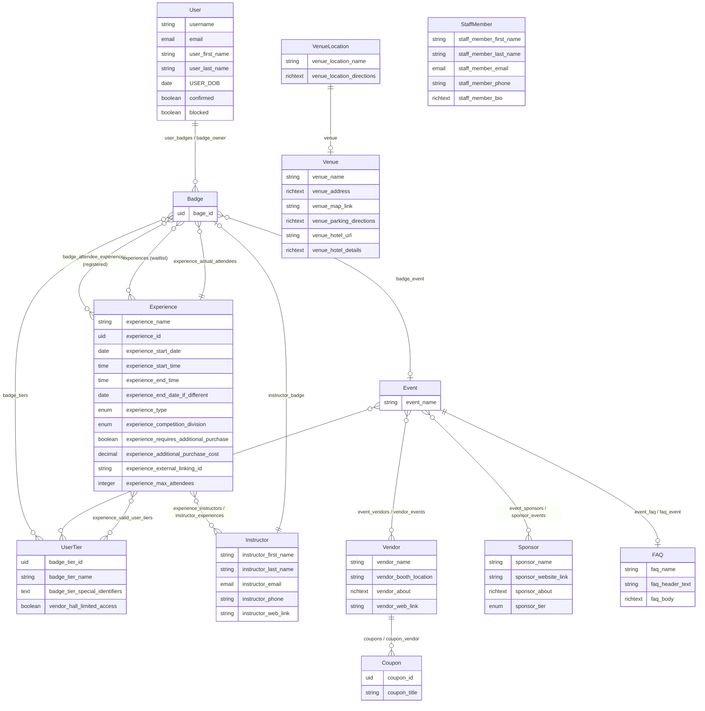

# RNGX Strapi Schema Reference

> Generated from `src/api/` and `src/extensions/` — **18 content types**, **9 shared components**

---

## Table of Contents

1. [Content Types Overview](#content-types-overview)
2. [Content Types](#content-types)
   - [Badge](#badge)
   - [Coupon](#coupon)
   - [Event](#event)
   - [Experience](#experience)
   - [FAQ](#faq)
   - [Instructor](#instructor)
   - [Sponsor](#sponsor)
   - [Staff Member](#staff-member)
   - [User Tier (Badge Tier)](#user-tier-badge-tier)
   - [Vendor](#vendor)
   - [Venue](#venue)
   - [Venue Location](#venue-location)
   - [About (Single)](#about-single)
   - [Article](#article)
   - [Author](#author)
   - [Category](#category)
   - [Global (Single)](#global-single)
   - [User (Extended)](#user-extended)
3. [Shared Components](#shared-components)
4. [Entity Relationship Diagram](#entity-relationship-diagram)

---

## Content Types Overview

| Display Name | API ID | Collection Name | Kind | Draft & Publish | i18n | shouldBeIgnored? |
|---|---|---|---|---|---|---|
| badge | `api::badge.badge` | `badges` | collectionType | Yes | No | No |
| coupon | `api::coupon.coupon` | `coupons` | collectionType | Yes | No | No |
| event | `api::event.event` | `events` | collectionType | Yes | No | No |
| experience | `api::experience.experience` | `experiences` | collectionType | Yes | No | No |
| faq | `api::faq.faq` | `faqs` | collectionType | Yes | No | No |
| instructor | `api::instructor.instructor` | `instructors` | collectionType | Yes | No | No |
| sponsor | `api::sponsor.sponsor` | `sponsors` | collectionType | Yes | No | No |
| staff member | `api::staff-member.staff-member` | `staff_members` | collectionType | Yes | **Yes** | No |
| badge_tier | `api::user-tier.user-tier` | `user_tiers` | collectionType | Yes | No | No |
| vendor | `api::vendor.vendor` | `vendors` | collectionType | Yes | No | No |
| venue | `api::venue.venue` | `venues` | collectionType | Yes | No | No |
| venue_location | `api::venue-location.venue-location` | `venue_locations` | collectionType | Yes | No | No |
| About | `api::about.about` | `abouts` | singleType | No | No | Yes |
| article | `api::article.article` | `articles` | collectionType | Yes | No | Yes |
| author | `api::author.author` | `authors` | collectionType | No | No | Yes |
| category | `api::category.category` | `categories` | collectionType | No | No | Yes |
| Global | `api::global.global` | `globals` | singleType | No | No | No |
| User | `plugin::users-permissions.user` | `up_users` | collectionType | No | No | No |

---

## Content Types

---

### Badge

**API ID:** `api::badge.badge` | **Collection:** `badges` | **Draft & Publish:** Yes

A badge represents a registered attendee/participant. It links a user to an event, their tier, and their experience sign-ups.

> **Note:** `bage_id` is a typo in the source schema (should be `badge_id`).

#### Fields

| Field | Type | Required | Unique | Notes |
|---|---|---|---|---|
| `bage_id` | uid | No | — | Auto-generated unique identifier *(typo: "bage")* |

#### Relations

| Field | Relation | Target | Inverse Field | Notes |
|---|---|---|---|---|
| `badge_event` | oneToOne | `api::event.event` | — | The event this badge grants access to |
| `badge_owner` | manyToOne | `plugin::users-permissions.user` | `user_badges` | The user who owns this badge |
| `badge_tiers` | oneToMany | `api::user-tier.user-tier` | — | Tiers assigned to this badge |
| `badge_attendee_experiences` | manyToMany | `api::experience.experience` | `experience_attendees` | Experiences the badge holder is registered for |
| `experiences` | manyToMany | `api::experience.experience` | `experience_attendee_waitlist` | Experiences the badge holder is waitlisted for |

---

### Coupon

**API ID:** `api::coupon.coupon` | **Collection:** `coupons` | **Draft & Publish:** Yes

Discount coupons issued by vendors.

#### Fields

| Field | Type | Required | Unique | Notes |
|---|---|---|---|---|
| `coupon_id` | uid | No | — | Auto-generated from `coupon_title` |
| `coupon_title` | string | No | — | Human-readable coupon name |

#### Relations

| Field | Relation | Target | Inverse Field | Notes |
|---|---|---|---|---|
| `coupon_vendor` | manyToOne | `api::vendor.vendor` | `coupons` | The vendor that issued this coupon |

---

### Event

**API ID:** `api::event.event` | **Collection:** `events` | **Draft & Publish:** Yes

A top-level event (e.g. a convention or conference). Links to vendors, sponsors, badge tiers, and a FAQ page.

#### Fields

| Field | Type | Required | Unique | Notes |
|---|---|---|---|---|
| `event_name` | string | No | — | Display name of the event |

#### Relations

| Field | Relation | Target | Inverse Field | Notes |
|---|---|---|---|---|
| `event_vendors` | manyToMany | `api::vendor.vendor` | `vendor_events` | Vendors participating in this event |
| `badge_tiers` | manyToMany | `api::user-tier.user-tier` | `badge_tier_events` | Valid badge tiers for this event |
| `event_sponsors` | manyToMany | `api::sponsor.sponsor` | `sponsor_events` | Sponsors of this event |
| `event_faq` | oneToOne | `api::faq.faq` | `faq_event` | FAQ page associated with this event |

---

### Experience

**API ID:** `api::experience.experience` | **Collection:** `experiences` | **Draft & Publish:** Yes

A scheduled session/activity within an event (class, seminar, competition, etc.).

#### Fields

| Field | Type | Required | Unique | Notes |
|---|---|---|---|---|
| `experience_name` | string | No | — | Display name |
| `experience_id` | uid | No | — | Auto-generated from `experience_name` |
| `experience_start_date` | date | No | — | |
| `experience_start_time` | time | No | — | |
| `experience_end_time` | time | No | — | |
| `experience_end_date_if_different` | date | No | — | Only needed if multi-day |
| `experience_type` | enumeration | No | — | Values: `class`, `seminar`, `competition`, `panel`, `certification`, `trade show / vendor hall` |
| `experience_competition_division` | enumeration | No | — | Values: `Division A`, `Division B`, `All` — **only visible when** `experience_type == "competition"` |
| `experience_requires_additional_purchase` | boolean | No | — | Default: `false` |
| `experience_additional_purchase_cost` | decimal | No | — | **Only visible when** `experience_requires_additional_purchase == true` |
| `experience_external_linking_id` | string | No | — | ID for external ticketing/scheduling systems |
| `experience_max_attendees` | integer | No | — | Capacity cap |

#### Relations

| Field | Relation | Target | Inverse Field | Notes |
|---|---|---|---|---|
| `experience_instructors` | manyToMany | `api::instructor.instructor` | `instructor_experiences` | Instructors leading this experience |
| `experience_valid_user_tiers` | oneToMany | `api::user-tier.user-tier` | — | Badge tiers allowed to attend |
| `experience_attendees` | manyToMany | `api::badge.badge` | `badge_attendee_experiences` | Confirmed registered badges |
| `experience_attendee_waitlist` | manyToMany | `api::badge.badge` | `experiences` | Waitlisted badges |
| `experience_actual_attendees` | oneToMany | `api::badge.badge` | — | Badges who actually attended (check-in) |

---

### FAQ

**API ID:** `api::faq.faq` | **Collection:** `faqs` | **Draft & Publish:** Yes

A FAQ document linked to a specific event.

#### Fields

| Field | Type | Required | Unique | Notes |
|---|---|---|---|---|
| `faq_name` | string | No | — | Internal name |
| `faq_header_text` | string | No | — | Displayed heading |
| `faq_body` | richtext | No | — | Introductory body text |
| `faq_faqs` | component (repeatable) | No | — | Component: `shared.faqs` — list of Q&A pairs |

#### Relations

| Field | Relation | Target | Inverse Field | Notes |
|---|---|---|---|---|
| `faq_event` | oneToOne | `api::event.event` | `event_faq` | The event this FAQ belongs to |

---

### Instructor

**API ID:** `api::instructor.instructor` | **Collection:** `instructors` | **Draft & Publish:** Yes

A person who leads experiences (classes, seminars, etc.).

#### Fields

| Field | Type | Required | Unique | Notes |
|---|---|---|---|---|
| `instructor_first_name` | string | No | — | |
| `instructor_last_name` | string | No | — | |
| `instructor_email` | email | No | — | |
| `instructor_phone` | string | No | — | |
| `instructor_web_link` | string | No | — | Personal/professional website |
| `instructor_headshot` | media (single) | No | — | Allowed types: images |
| `instructor_social_medias` | component (repeatable) | No | — | Component: `shared.social-media-links` |

#### Relations

| Field | Relation | Target | Inverse Field | Notes |
|---|---|---|---|---|
| `instructor_experiences` | manyToMany | `api::experience.experience` | `experience_instructors` | Experiences this instructor leads |
| `instructor_badge` | oneToOne | `api::badge.badge` | — | The instructor's own event badge |

---

### Sponsor

**API ID:** `api::sponsor.sponsor` | **Collection:** `sponsors` | **Draft & Publish:** Yes

A company or entity sponsoring an event.

#### Fields

| Field | Type | Required | Unique | Notes |
|---|---|---|---|---|
| `sponsor_name` | string | No | — | |
| `sponsor_tile_image` | media (single) | No | — | Thumbnail/logo image |
| `sponsor_hero_image` | media (single) | No | — | Full-width banner image |
| `sponsor_website_link` | string | No | — | |
| `sponsor_about` | richtext | No | — | Description/bio |
| `sponsor_tier` | enumeration | No | — | Values: `title_sponsor`, `major_sponsor`, `sponsor`, `minor_sponsor` |
| `sponsor_social_medias` | component (repeatable) | No | — | Component: `shared.social-media-links` |

#### Relations

| Field | Relation | Target | Inverse Field | Notes |
|---|---|---|---|---|
| `sponsor_events` | manyToMany | `api::event.event` | `event_sponsors` | Events this sponsor is associated with |

---

### Staff Member

**API ID:** `api::staff-member.staff-member` | **Collection:** `staff_members` | **Draft & Publish:** Yes | **i18n:** Enabled (all fields localized)

Organizational staff/team members.

#### Fields

| Field | Type | Required | Unique | i18n | Notes |
|---|---|---|---|---|---|
| `staff_member_first_name` | string | No | — | Yes | |
| `staff_member_last_name` | string | No | — | Yes | |
| `staff_member_email` | email | No | — | Yes | |
| `staff_member_phone` | string | No | — | Yes | Regex: `^[1-9]\d{2}-\d{3}-\d{4}` (US format XXX-XXX-XXXX) |
| `staff_member_headshot` | media (single) | No | — | Yes | Allowed types: images |
| `staff_member_bio` | richtext | No | — | Yes | |

---

### User Tier (Badge Tier)

**API ID:** `api::user-tier.user-tier` | **Collection:** `user_tiers` | **Display Name:** `badge_tier` | **Draft & Publish:** Yes

Defines access levels/tiers for event badges (e.g. General Admission, VIP).

#### Fields

| Field | Type | Required | Unique | Notes |
|---|---|---|---|---|
| `badge_tier_id` | uid | No | — | Auto-generated identifier |
| `badge_tier_name` | string | No | — | Display name of the tier |
| `badge_tier_special_identifiers` | text | No | — | Free-form tags/identifiers |
| `vendor_hall_limited_access` | boolean | No | — | Default: `false` — restricts vendor hall access |
| `badge_tier_valid_dates` | component (repeatable) | No | — | Component: `shared.valid-dates` — days the tier is valid |

#### Relations

| Field | Relation | Target | Inverse Field | Notes |
|---|---|---|---|---|
| `badge_tier_events` | manyToMany | `api::event.event` | `badge_tiers` | Events this tier is valid for |

---

### Vendor

**API ID:** `api::vendor.vendor` | **Collection:** `vendors` | **Draft & Publish:** Yes

A vendor participating in the event's vendor hall.

#### Fields

| Field | Type | Required | Unique | Notes |
|---|---|---|---|---|
| `vendor_name` | string | No | — | |
| `vendor_tile_image` | media (single) | No | — | Thumbnail/logo |
| `vendor_hero_image` | media (single) | No | — | Banner image |
| `vendor_booth_location` | string | No | — | Booth identifier/location in hall |
| `vendor_about` | richtext | No | — | Description |
| `vendor_web_link` | string | No | — | |
| `vendor_social_medias` | component (repeatable) | No | — | Component: `shared.social-media-links` |
| `vendor_contact_info` | component (single) | No | — | Component: `shared.contact-info` |

#### Relations

| Field | Relation | Target | Inverse Field | Notes |
|---|---|---|---|---|
| `coupons` | oneToMany | `api::coupon.coupon` | `coupon_vendor` | Coupons issued by this vendor |
| `vendor_events` | manyToMany | `api::event.event` | `event_vendors` | Events this vendor participates in |

---

### Venue

**API ID:** `api::venue.venue` | **Collection:** `venues` | **Draft & Publish:** Yes

A physical venue where an event is held.

#### Fields

| Field | Type | Required | Unique | Notes |
|---|---|---|---|---|
| `venue_name` | string | No | — | |
| `venue_address` | richtext | No | — | Full address |
| `venue_map_link` | string | No | — | Link to map (Google Maps etc.) |
| `venue_parking_directions` | richtext | No | — | |
| `venue_hotel_url` | string | No | — | Link to nearby/partner hotel |
| `venue_hotel_details` | richtext | No | — | Hotel booking details |

---

### Venue Location

**API ID:** `api::venue-location.venue-location` | **Collection:** `venue_locations` | **Draft & Publish:** Yes

A specific room or area within a venue (used to locate experiences).

#### Fields

| Field | Type | Required | Unique | Notes |
|---|---|---|---|---|
| `venue_location_name` | string | No | — | Room/area name |
| `venue_location_directions` | richtext | No | — | Directions within the venue |

#### Relations

| Field | Relation | Target | Inverse Field | Notes |
|---|---|---|---|---|
| `venue` | oneToOne | `api::venue.venue` | — | The parent venue |

---

### About (Single)

**API ID:** `api::about.about` | **Collection:** `abouts` | **Kind:** singleType | **Draft & Publish:** No

Single-type page for "about" content.

#### Fields

| Field | Type | Notes |
|---|---|---|
| `title` | string | Page title |
| `blocks` | dynamiczone | Components: `shared.media`, `shared.quote`, `shared.rich-text`, `shared.slider` |

---

### Article

**API ID:** `api::article.article` | **Collection:** `articles` | **Draft & Publish:** Yes

Blog/news articles.

#### Fields

| Field | Type | Required | Notes |
|---|---|---|---|
| `title` | string | No | |
| `description` | text | No | Max length: 80 |
| `slug` | uid | No | Auto-generated from `title` |
| `cover` | media (single) | No | Allowed types: images, files, videos |
| `blocks` | dynamiczone | — | Components: `shared.media`, `shared.quote`, `shared.rich-text`, `shared.slider` |

#### Relations

| Field | Relation | Target | Inverse Field |
|---|---|---|---|
| `author` | manyToOne | `api::author.author` | `articles` |
| `category` | manyToOne | `api::category.category` | `articles` |

---

### Author

**API ID:** `api::author.author` | **Collection:** `authors` | **Draft & Publish:** No

Authors of articles.

#### Fields

| Field | Type | Required | Notes |
|---|---|---|---|
| `name` | string | No | |
| `email` | string | No | |
| `avatar` | media (single) | No | Allowed types: images, files, videos |

#### Relations

| Field | Relation | Target | Inverse Field |
|---|---|---|---|
| `articles` | oneToMany | `api::article.article` | `author` |

---

### Category

**API ID:** `api::category.category` | **Collection:** `categories` | **Draft & Publish:** No

Categories for articles.

#### Fields

| Field | Type | Notes |
|---|---|---|
| `name` | string | |
| `slug` | uid | Auto-generated |
| `description` | text | |

#### Relations

| Field | Relation | Target | Inverse Field |
|---|---|---|---|
| `articles` | oneToMany | `api::article.article` | `category` |

---

### Global (Single)

**API ID:** `api::global.global` | **Collection:** `globals` | **Kind:** singleType | **Draft & Publish:** No

Global site settings.

#### Fields

| Field | Type | Required | Notes |
|---|---|---|---|
| `siteName` | string | **Yes** | |
| `siteDescription` | text | **Yes** | |
| `favicon` | media (single) | No | Allowed types: images, files, videos |
| `defaultSeo` | component (single) | No | Component: `shared.seo` |

---

### User (Extended)

**API ID:** `plugin::users-permissions.user` | **Collection:** `up_users` | **Draft & Publish:** No

Extended from the Strapi `users-permissions` plugin. Fields marked **system** are non-configurable.

#### System Fields

| Field | Type | Required | Private | Notes |
|---|---|---|---|---|
| `username` | string | **Yes** | No | Min length: 3, Unique |
| `email` | email | **Yes** | No | Min length: 6 |
| `provider` | string | No | No | Auth provider (local, google, etc.) |
| `password` | password | No | **Yes** | Min length: 6, not searchable |
| `resetPasswordToken` | string | No | **Yes** | Not searchable |
| `confirmationToken` | string | No | **Yes** | Not searchable |
| `confirmed` | boolean | No | No | Default: `false` |
| `blocked` | boolean | No | No | Default: `false` |

#### Custom Fields

| Field | Type | Required | Notes |
|---|---|---|---|
| `user_first_name` | string | No | |
| `user_last_name` | string | No | |
| `USER_DOB` | date | No | User date of birth |

#### Relations

| Field | Relation | Target | Inverse Field | Notes |
|---|---|---|---|---|
| `role` | manyToOne | `plugin::users-permissions.role` | `users` | **System** |
| `user_badges` | oneToMany | `api::badge.badge` | `badge_owner` | All badges owned by this user |

---

## Shared Components

All components live in `src/components/shared/`.

---

### `shared.contact-info`

**Collection:** `components_shared_contact_infos`

| Field | Type | Notes |
|---|---|---|
| `contact_info_email` | email | |
| `contact_info_phone` | string | |
| `address_map_link` | string | URL to map |

---

### `shared.faqs`

**Collection:** `components_shared_faqs`

| Field | Type | Notes |
|---|---|---|
| `faqs_question` | string | The question |
| `faqs_answer` | richtext | The answer |

---

### `shared.media`

**Collection:** `components_shared_media`

| Field | Type | Notes |
|---|---|---|
| `file` | media (single) | Allowed types: images, files, videos |

---

### `shared.quote`

**Collection:** `components_shared_quotes`

| Field | Type | Notes |
|---|---|---|
| `title` | string | |
| `body` | text | |

---

### `shared.rich-text`

**Collection:** `components_shared_rich_texts`

| Field | Type | Notes |
|---|---|---|
| `body` | richtext | |

---

### `shared.seo`

**Collection:** `components_shared_seos`

| Field | Type | Required | Notes |
|---|---|---|---|
| `metaTitle` | string | **Yes** | |
| `metaDescription` | text | **Yes** | |
| `shareImage` | media (single) | No | Allowed types: images |

---

### `shared.slider`

**Collection:** `components_shared_sliders`

| Field | Type | Notes |
|---|---|---|
| `files` | media (multiple) | Allowed types: images |

---

### `shared.social-media-links`

**Collection:** `components_shared_social_media_links`

| Field | Type | Notes |
|---|---|---|
| `social_platform` | enumeration | Values: Email, Phone#, Website, LinkTree, Facebook, YouTube, WhatsApp, Instagram, WeChat, TikTok, Telegram, Snapchat, X (formerly Twitter), Pinterest, Reddit, LinkedIn, Discord, Threads, Kuaishou, QQ, Quora, Tumblr, Line, BeReal, Twitch, Viber, VK (VKontakte), Mastodon, Clubhouse |
| `social_link` | string | The URL or contact value |

---

### `shared.valid-dates`

**Collection:** `components_shared_valid_dates`

| Field | Type | Notes |
|---|---|---|
| `valid_date` | date | A single valid date |

---

## Entity Relationship Diagram

> Rendered with [Mermaid](https://mermaid.js.org/). View in GitHub, VS Code (with Mermaid extension), or at mermaid.live.

